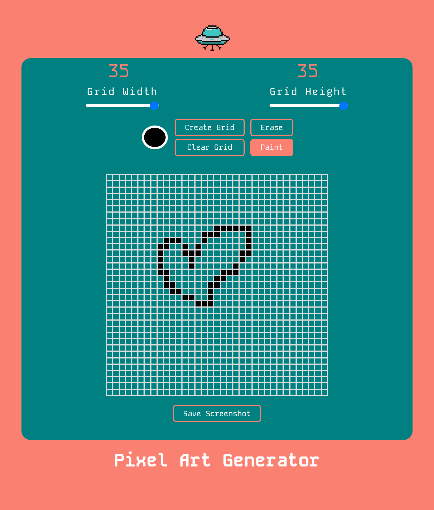

# Pixel Art Generator - Vanilla Javascript Project

## Description

# Pixel Art Generator

This project is a Pixel Art Generator built using vanilla JavaScript, HTML, and SCSS. It allows users to create their own pixel art in a grid that can be up to 35x35 cells. Users can choose their own colors and draw on the grid to create unique pixel art designs. Once a design is complete, users have the ability to save their creation as a screenshot for future use or sharing. This project is a fun and creative tool for anyone interested in pixel art or digital design.

### Screenshot

### Prerequisites

This project uses SCSS for styling, Javascript for functionality, and Vite for building and serving. Make sure you have [Node.js](https://nodejs.org/) installed on your machine, as it's required to run Vite.

## Installation

1. Clone this repository to your local machine or download the files as a zip.
2. Navigate to the project directory.
3. Run `npm install` to install the project dependencies, including Vite.
4. Run `npm run dev` to start the Vite development server. This will also automatically open the project in your default web browser.

## Usage

1. Open the Pixel Art Generator in your web browser.
2. You will see a grid of cells where you can draw your pixel art. By default, the grid is 35x35 cells, but you can adjust this to your liking.
3. Select a color from the color picker at the top of the page.
4. Click on a cell in the grid to fill it with the selected color. You can click and drag to fill multiple cells.
5. If you make a mistake, use the erase button to remove the color from a cell.
6. Once you're satisfied with your design, you can save it as a screenshot by clicking the "Save Screenshot" button. This will download a .png image of your design.
7. Have fun creating your own unique pixel art!

## Contributing

This project is a simple practice project and is not currently accepting contributions.

## Credits

Inspired by [ASMR Programming]'s Pixel Art Generator tutorial on YouTube.
Original video at: [https://www.youtube.com/watch?v=DfDPJqD3FjI&t=16s]

## License

This project is licensed under the MIT License - see the `LICENSE.md` file for details.

## Contact

For any questions or concerns, please contact Juan Lagunas at dev.jlagunas@gmail.com.
